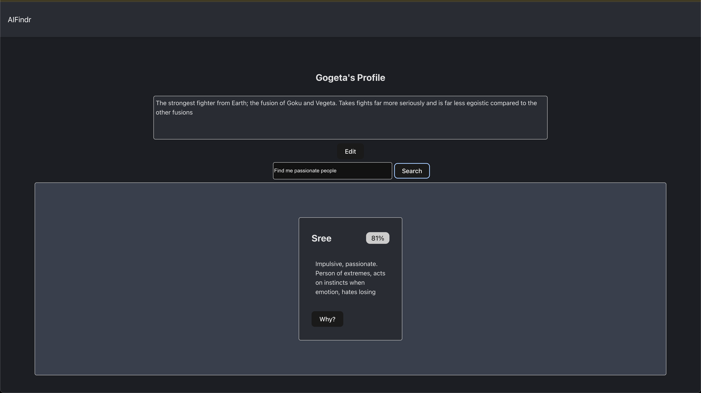
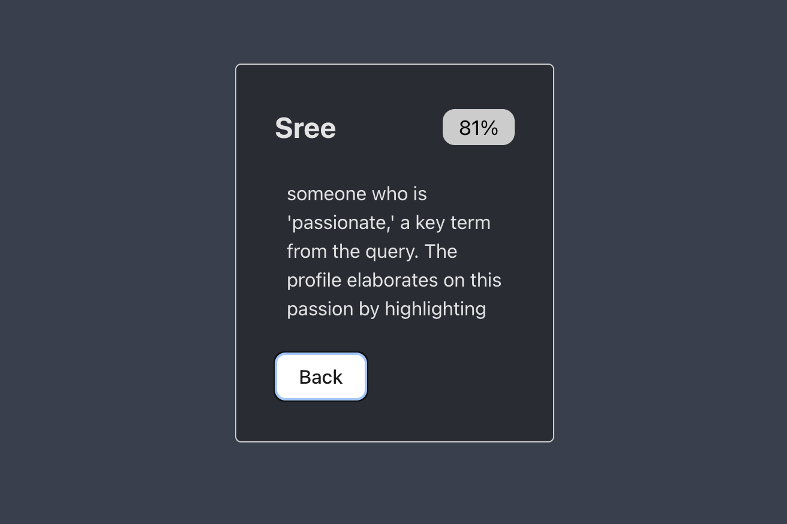

# AIFindr

---

## Thought Process

---

Out of the given project, the most personally-appealing idea was SynapseSpace. But due to time constraints (and scope of the project),
the selection was switched to AIFindr owing to its comparatively lower complexity. The backend was fairly straightforward to build, since
it is a semantic search API with a few extra endpoints for profiles and essentially. Frontend was slightly more complicated on the design-side,
since UX design is not exactly a forte. The frontend is bare-bones; a show-piece for the backend functionalities. In order to simplify the running process,
the whole project is dockerized; a single command sets up and starts all components. Persistence on the client-side is session-based. But profiles once created are persisted in the database (until the Pinecone container is stopped, at which point the data will be deleted). A user's profile can be updated during a given session.

## Tech Stack

---

* Python - FastAPI
* JavaScript - Vite + React
* Pinecone Local
* Docker

## Setup/Run Instruction

---

* [Install](https://www.docker.com/) Docker CLI/Docker Desktop
* From the project root, run:

```bash
docker compose up -d
```

## Screenshots





## Challenges

---

* Deciding on the scope
* Accounting for Pinecone local's in-memory storage